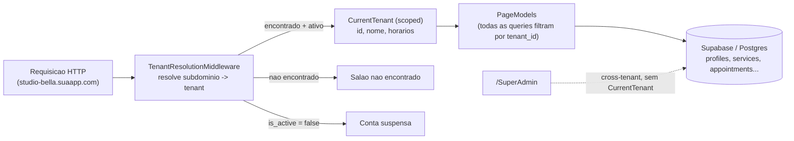

# 💇‍♀️ MarcAi

**Plataforma de agendamento multi-tenant para saloes de estetica.**
Uma unica aplicacao atende varios saloes ao mesmo tempo — cada um com o proprio subdominio, dados 100% isolados e sua propria equipe, agenda e financeiro.

<p align="left">
  
  
  
  
  
  
</p>

> 📌 O codigo/namespace do projeto continua `AndressaLeite` — apenas a marca voltada ao usuario final mudou para **MarcAi**. "Studio Bella" foi o primeiro salao do sistema e segue existindo como um tenant normal.

---

## Sumario

- [Visao geral](#-visao-geral)
- [Funcionalidades](#-funcionalidades)
- [Papeis de usuario](#-papeis-de-usuario)
- [Arquitetura multi-tenant](#-arquitetura-multi-tenant)
- [Stack tecnica](#-stack-tecnica)
- [Como rodar localmente](#-como-rodar-localmente)
- [Deploy com Docker](#-deploy-com-docker)
- [Testes e CI](#-testes-e-ci)
- [Estrutura do projeto](#-estrutura-do-projeto)
- [Status e roadmap](#-status-e-roadmap)
- [Divida tecnica conhecida](#-divida-tecnica-conhecida)

---

## 🔎 Visao geral

O MarcAi cobre o fluxo real de operacao de um salao de estetica: cliente escolhe profissional, servico e horario respeitando o expediente e o almoco do salao; a profissional confirma, atende, registra o que foi cobrado e como foi pago; a dona do salao acompanha indicadores financeiros e, se quiser, atende clientes tambem. Tudo isolado por salao (tenant), num unico banco e numa unica aplicacao.

## ✨ Funcionalidades

### Para o cliente
- Cadastro e login proprios (cookie + BCrypt), por salao.
- Agendamento guiado: profissional → servico → data/hora, com preco e duracao **especificos daquela profissional** (nao um valor generico de catalogo).
- Bloqueio automatico de horarios fora do expediente, dentro do almoco ou em conflito com outro agendamento — validado tambem no banco (constraint `EXCLUDE`), nao so no C#.
- Cancelamento com regra de antecedencia minima (bloqueado a menos de 1h do horario, reforcado por trigger no Postgres).
- Historico paginado de agendamentos concluidos/cancelados.

### Para a profissional
- Agenda do dia com confirmacao/conclusao de atendimento em um clique.
- **Conclusao enriquecida**: ao concluir, ajusta o servico prestado, o valor cobrado e registra a forma de pagamento (dinheiro / Pix / debito / credito / outro) e observacoes livres.
- **Agendamento manual**: registra encaixe, ligacao ou walk-in direto na propria agenda, sem precisar que o cliente tenha conta.
- **"Meus Servicos"**: personaliza preco e/ou duracao de qualquer servico do catalogo, sem afetar o valor de outras profissionais.
- Lembrete de atendimento via WhatsApp com um clique (`wa.me` com mensagem pre-pronta).
- Toggle de historico dos proprios atendimentos, com o mesmo padrao de paginacao do cliente.

### Para a dona do salao (admin)
- Gestao de equipe (cadastro/remocao de profissionais) e catalogo de servicos (criar/ativar/desativar/remover).
- Configuracao do **horario de funcionamento e do almoco**, por salao — sem precisar de deploy pra mudar.
- **Dashboard de metricas**: atendimentos concluidos hoje, receita esperada do dia, detalhamento de receita por forma de pagamento (mes atual) e painel de observacoes recentes dos atendimentos.
- Tambem atende como "profissional premium": agenda propria, agendamento manual e "Meus Servicos" — sem duplicar telas.

### Para o dono da plataforma (superadmin)
- Painel cross-tenant (`/SuperAdmin`), fora do modelo multi-tenant, numa tabela propria.
- Ativa/desativa a "licenca" de qualquer salao com um clique.
- Login em duas etapas com **2FA via TOTP** (RFC 6238, compativel com Google Authenticator/Authy), implementado do zero e validado contra os vetores oficiais do RFC.
- Troca de senha e ativacao/desativacao de 2FA em `/SuperAdmin/Security`.

## 👥 Papeis de usuario

| Papel | Escopo | Onde vive |
|---|---|---|
| **Superadmin** | Cross-tenant (dono da plataforma) | tabela `platform_admins` |
| **Admin** | Dono/gestor do salao — gestao + agenda propria | tabela `profiles`, `role = admin` |
| **Employee** (profissional) | Agenda propria, atendimentos | tabela `profiles`, `role = employee` |
| **Client** (cliente) | Agenda, cancela, historico | tabela `profiles`, `role = client` |

## 🏢 Arquitetura multi-tenant



- **Isolamento por subdominio**: cada salao tem seu proprio `studio-bella.suaapp.com`, sem subdominio = area da plataforma (marketing + onboarding self-service de novo salao).
- **Duas camadas de seguranca**: cookie de sessao host-scoped (nao compartilhado entre subdominios) **+** claim `tenant_id` no cookie, checada contra o tenant resolvido pela URL em todo request — sessao trocada de subdominio e encerrada automaticamente.
- **Cache de resolucao de tenant** em `IMemoryCache` (TTL 60s) pra nao bater no banco a cada request.
- Onboarding self-service: qualquer pessoa cria seu proprio salao (slug + dados), sem depender do dono da plataforma.

## 🧱 Stack tecnica

| Camada | Tecnologia |
|---|---|
| Backend | ASP.NET Core **Razor Pages** (.NET 10) |
| Banco de dados | **Supabase** (Postgres + PostgREST, via `postgrest-csharp`/`supabase-csharp`) — sem EF Core |
| Autenticacao | Cookie proprio + **BCrypt** (nao usa Supabase Auth/Gotrue) |
| 2FA | **TOTP (RFC 6238)** implementado do zero, sem pacote externo pro algoritmo |
| QR Code | **QRCoder** (renderer 100% C#, sem `System.Drawing.Common` em runtime) |
| Testes | **xUnit** (49 testes) |
| CI | **GitHub Actions** (`dotnet build` + `dotnet test` em todo push/PR) |
| Deploy | **Docker** multi-estagio (build com SDK, runtime com `aspnet`, usuario nao-root) |

## 🚀 Como rodar localmente

**1. Segredos do Supabase** (nunca em `appsettings.json` versionado):
```bash
dotnet user-secrets set "Supabase:Url" "https://SEU-PROJETO.supabase.co"
dotnet user-secrets set "Supabase:SecretKey" "sb_secret_..."
```

**2. Rode as migrations**, nesta ordem, no SQL Editor do Supabase:
```
supabase/migrations/0001_auth_columns_and_rls.sql
supabase/migrations/0002_multi_tenant.sql
supabase/migrations/0003_agenda_enriquecida.sql
supabase/migrations/0004_platform_admins.sql
supabase/migrations/0005_superadmin_security.sql
supabase/migrations/0006_cancellation_trigger_and_overlap_constraint.sql
```
Todas sao idempotentes (podem rodar de novo sem erro). A `0002` semeia o tenant `studio-bella`; a `0004` semeia a conta de superadmin; a `0006` exige a extensao `btree_gist` (a propria migration ja cria).

**3. Suba a aplicacao:**
```bash
cd AndressaLeite
dotnet run
```

| URL | O que e |
|---|---|
| `http://localhost:5081/` | Pagina da plataforma (onboarding) |
| `http://localhost:5081/SuperAdmin/Login` | Login do superadmin |
| `http://studio-bella.localhost:5081/` | Salao de exemplo |
| `http://studio-bella.localhost:5081/Auth/Login` | Login do salao |

> Navegadores modernos resolvem `*.localhost` pra `127.0.0.1` nativamente — nao precisa editar `hosts`. Use o CTA "Criar meu salao" na home da plataforma pra testar com um segundo tenant.

## 🐳 Deploy com Docker

```bash
docker build -t marcai:latest .

docker run -p 8080:8080 \
  -e Supabase__Url="https://SEU-PROJETO.supabase.co" \
  -e Supabase__SecretKey="sb_secret_..." \
  -e Tenancy__RootDomain="suaapp.com" \
  marcai:latest
```

Build multi-estagio (SDK só pra compilar, runtime `aspnet` puro), container roda como usuario nao-root, escuta em `8080`. Reverse proxy/TLS wildcard e DNS wildcard ficam fora do container, na infraestrutura de deploy.

## 🧪 Testes e CI

```bash
dotnet test AndressaLeite.Tests
```

49 testes cobrindo:
- **`TotpService`**: os 5 vetores oficiais do RFC 6238 (Appendix B), rejeicao de codigo invalido/fora da janela, round-trip de Base32.
- **`AuthorizationService`**: protecao contra open-redirect, resolucao de landing page por papel, leitura de claims (`tenant_id` incluso).

Todo push/PR pra `main` roda `dotnet build` + `dotnet test` via GitHub Actions.

## 📂 Estrutura do projeto

```
AndressaLeite/
├── Models/            Tenant, Profile, Appointement, Service, ProfessionalService, PlatformAdmin...
├── Pages/
│   ├── Onboarding/     Criacao self-service de novo salao
│   ├── Auth/           Cadastro / Login / Logout (por tenant)
│   ├── Cliente/        Agendamento e historico do cliente
│   ├── Profissional/   Agenda, conclusao, "Meus Servicos", agendamento manual
│   ├── Admin/          Gestao do salao + dashboard de metricas
│   └── SuperAdmin/     Painel cross-tenant + 2FA
├── Services/           CurrentTenant, TenantResolutionMiddleware, AppointmentBookingService, TotpService...
└── Program.cs

AndressaLeite.Tests/    Testes xUnit (TotpService, AuthorizationService)
supabase/migrations/    Schema incremental do Postgres (0001 a 0006)
Dockerfile              Build multi-estagio pra deploy
```

## 🗺️ Status e roadmap

O roadmap completo da **"Agenda Enriquecida"** (horario dinamico, preco por profissional, agendamento manual, conclusao enriquecida, admin premium, dashboard de metricas, lembrete via WhatsApp) esta **100% implementado**, junto com multi-tenancy, superadmin com 2FA, testes automatizados, CI e Dockerfile.

Detalhes de cada decisao, migrations pendentes de rodar em producao e itens bloqueados por decisao de produto (ex.: fluxo de "esqueci minha senha", que depende da escolha de um provedor de e-mail) estao documentados em [`readme.txt`](./readme.txt).

## ⚠️ Divida tecnica conhecida

- Isolamento entre tenants e garantido **em nivel de aplicacao** (todo `.Where(tenant_id ==)`), nao por RLS com policies reais no Postgres — o backend usa a service key, que ignora RLS.
- Sem billing/assinatura: ativar/desativar salao ainda e um toggle manual do superadmin.
- Sem branding/dominio customizado por tenant.
- Fluxos que dependem de e-mail transacional (recuperacao de senha, verificacao de e-mail, convite de equipe, notificacao automatica) estao propositalmente adiados ate a escolha de um provedor.

---

<p align="center">Feito com 💜 pra donas de salao que merecem um sistema tao capricho quanto o trabalho delas.</p>
